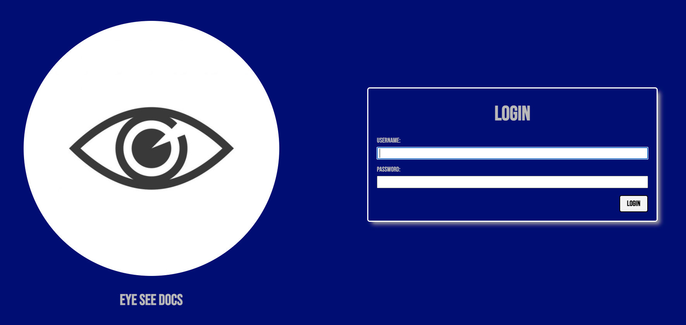
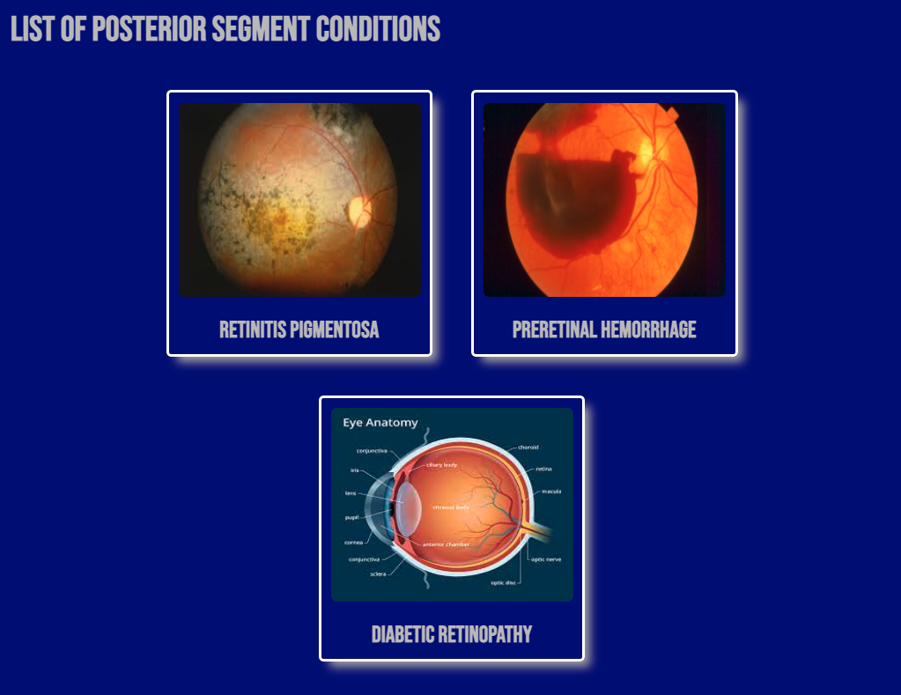

# Unit 3 Project: Eye See Docs
An app to store and view encountered cases across one's optometric career. Great for teaching or personal use.

# Links
Check out the app <a href="https://eyeseedocs.herokuapp.com/">here</a>!
 
See the planning it took to make the app <a href="https://trello.com/b/L4BrNWGt/unit-3-project">here</a>.

# Screenshots

# Technologies Used
<ul>
  <li>HTML</li>
  <li>CSS</li>
  <li>Javascript</li>
  <li>Python</li>
  <li>Django</li>
</ul>

# Credits
Images: <a href="https://www.allaboutvision.com/resources/anatomy.htm">All About Vision</a>, <a href="https://www.freepik.com/free-icon/eye_775336.htm">freepik</a>
 
Fonts: <a href="https://fonts.google.com/" rel="noopener noreferrer" target="_blank">Google Fonts</a>

# Next Steps
<ul>
  <li>Add light/dark mode</li>
  <li>Add comments functionality</li>
</ul>

